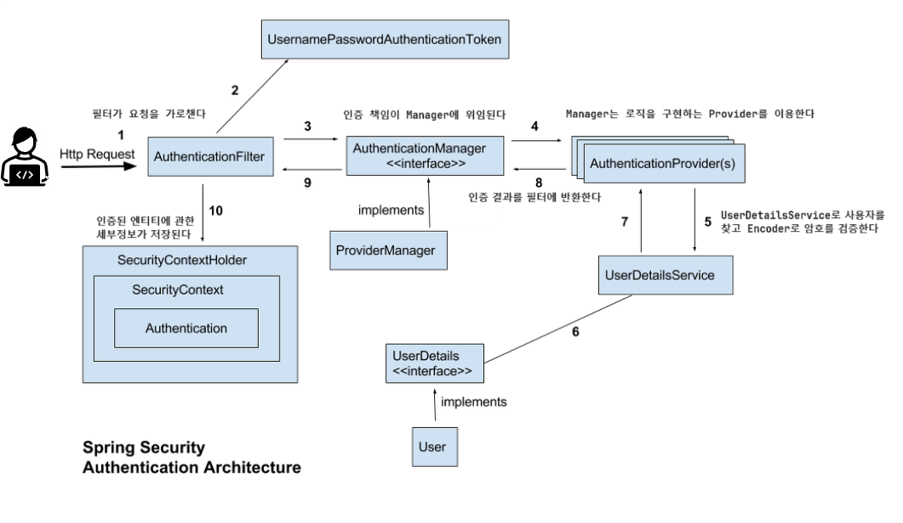

# [스프링 시큐리티] 스프링 시큐리티 & JWT
### 환경설정
- 스프링 5.3.23  
- 스프링 부트 2.7.4  
- 자바 17  
- 스프링 시큐리티 5.7.3  
- MySql 8.0.36  
- JPA 2.7.3  

### 준비 과정
- 스프링 부트3 버전에서는 시큐리티 6사용 되므로 2로 다운그레이

### 시큐리티 사용 이유
- 인증 
- 권한 부여
- CSRF 보호: 웹 애플리케이션 취약점을 악용하여 사이트 간 요청 위조 공격을 수행하는 것을 방지하는 보안 조치

### 시큐리티 작동 방식
- 요청을 가로채서 보호된 자원에 대한 액세스를 허용하기 전에 보안 검사를 수행
- 
### JWT(JSON Web Token) 사용 이유
- 서버의 확장성이 높으며 대량의 트래픽이 발생해도 대처할 수 있음
- 특정 DB/서버에 의존하지 않아도 인증할 수 있음

### JWT 구성, 방식
- 헤더 Header: 토큰 타입, 암호화 알고리즘 명시
- 페이로드 Payload: JWT에 넣을 데이터, JWT 발급, 만료일 등 명시
- 시그니처 Signature: 헤더, 페이로드가 변조 되었는지를 확인하는 역할
- 토큰 발급: 많은 사용자의 인증 방식을 저장하고 있지 않기 때문에, 가볍고 확장성이 좋음
- 세션 발급: 무겁지만, 그만큼 보안성이 좋은 방식

### 참고
- SecurityConfig.java
  - WebSecurityConfigurerAdapter 지원 중단(5.7 이상)-> SecurityFilterChain 빈등록으로 해결
  - authorizeRequests 대체 권고(5.6.1 이상) -> authorizeHttpRequests 
    - / https://whatistudy.tistory.com/entry/%EC%B6%94%EA%B0%80-AuthorizeRequests-vs-AuthorizeHttpRequests / https://velog.io/@csh0034/Spring-Security-Config-Refactoring /
- 카카오 로그인
  - client-authentication-method: POST 필요
  - ProviderId 캐스팅 수정 필요
- 깃 yml 파일 이그노어시 반영 안될때 캐시 삭제 필요
  - git rm -r --cached 
  - git add .
  - git commit -m "-"
